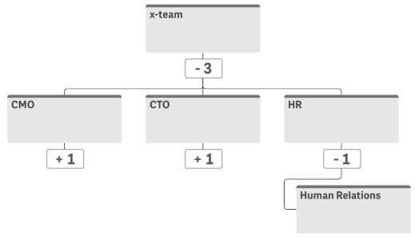

# sn-org-chart

[](https://circleci.com/gh/qlik-oss/sn-org-chart)
[](https://coveralls.io/github/qlik-oss/sn-org-chart)

Organizational chart for use with Qlik's Analytics Platform.



## Installing

Install as npm package: `npm install @nebula.js/sn-org-chart`.

You can also load through the script tag directly from [https://unpkg.com](https://unpkg.com/@nebula.js/sn-org-chart).

## Usage

```js

import { embed } from '@nebula.js/stardust';
import org from '@nebula.js/sn-org-chart';

// 'app' is an enigma app model
const nuked = embed(app, {
  types: [{
    name: 'orgchart',
    load: () => Promise.resolve(org);
  }]
});

embed.render({
  element,
  type: 'orgchart',
});
```
